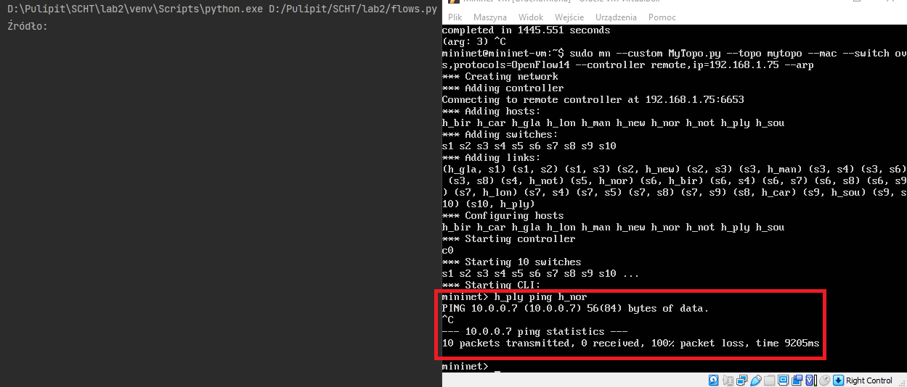
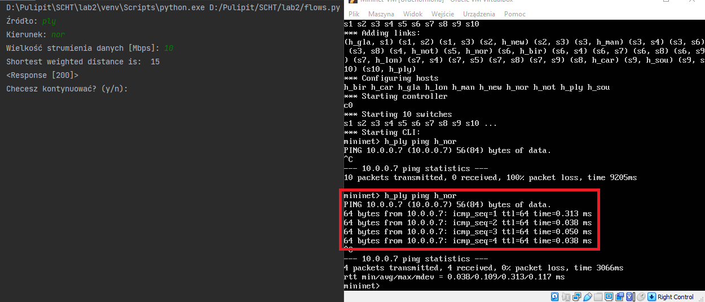
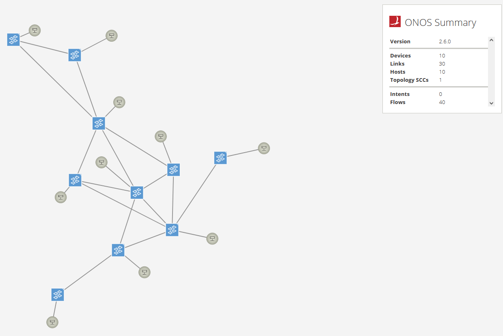
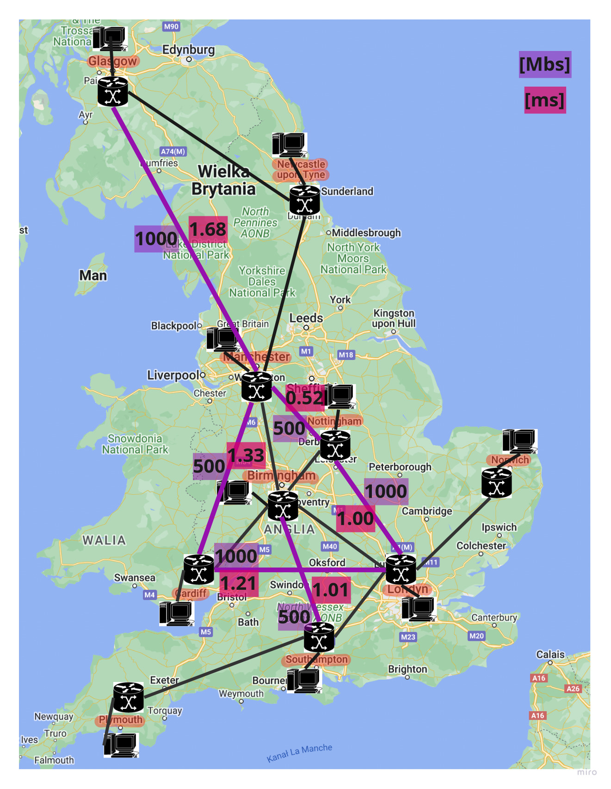

# ONOS Flows Generator
Python program for generating flows in the Mininet network emulator using ONOS REST API. 

The application collects information from the user regarding the source, direction and size of the data stream. Then, using the [igraph](https://python.igraph.org/en/stable/) library, it determines the shortest path between the switches, taking into account the path weights. Based on the path created in this way, the application creates a JSON file containing the network nodes configuration and, using the "requests" library, sends the POST command to configure the network nodes.

The weights set in the application have been selected so as to enable the desired division of data streams between the direct and the alternative route at the level of approximately 2:1.

Data on hosts and switches connected to them used in the application are loaded from the python file and downloaded using the REST command of the ONOS controller (GET /links).

## Usage
This is a simple example of usage of this program. The first screenshot shows the execution of the ping command when the flows are not established, while on the second one flows are already established using the flows_generator.py.

## Topology
Topology that program was used on:

